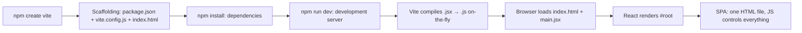

# **პრეზენტაცია: React SEO — პრაქტიკული ქლასვორკი**
## **ლექცია #4 — ქლასვორკი**

---

## **სლაიდი 1: შესავალი — SPA-ს SEO პრობლემა**
### **რატომ არის React (SPA) განსხვავებული ტრადიციული საიტებისგან?**

**ტრადიციული საიტი (MPA — Multi Page Application):**
```
სერვერი → აგზავნის მზა HTML-ს (სავსე ტექსტით, სათაურებით, ლინკებით)
Googlebot → ხედავს ყველაფერს მაშინვე → ინდექსირებს
```

**React SPA (Single Page Application):**
```
სერვერი → აგზავნის ცარიელ <div id="root"></div> + JavaScript
Googlebot → ხედავს ცარიელ გვერდს → დებს რიგში → ელოდება JS-ის რენდერინგს
```

**მთავარი პრობლემა:** Googlebot მუშაობს ორფაზიანი ინდექსაციით (Two-Wave Indexing):
1. **ფაზა 1 (Crawl):** იწერს HTML-ს — ხედავს ცარიელ გვერდს → აყენებს რიგში
2. **ფაზა 2 (Render):** როცა თავისუფალი რესურსი აქვს (შეიძლება საათები/დღეები), უშვებს JS-ს, ხატავს გვერდს და მხოლოდ მაშინ აინდექსებს

**ამიტომ React-ში SEO არ არის ჩვეულებრივი HTML-ის "სწორად დაწერა" — ეს არის Googlebot-ის დახმარება, რომ მან რენდერინგამდეც გაიგოს ჩვენი გვერდი.**

### **როგორ ვეხმარებით Googlebot-ს? (დღევანდელი გეგმა)**
1. 🔧 Chrome Extensions — რა ინსტრუმენტები გვჭირდება?
2. ⚛️ React პროექტის შექმნა
3. 🔗 React Router — SEO მეგობრული ნავიგაცია
4. 🏬 **Ecommerce URL სტრუქტურა** — Routes, Params, Breadcrumbs
5. 🎯 **react-helmet-async** — Meta თეგების მართვა
6. 🚀 Performance ოპტიმიზაცია
7. 📝 XML Sitemap + **HTML Sitemap** (`/sitemap` გვერდი) + Robots.txt
8. 🏁 Build & Deploy

---

## **სლაიდი 2: 1. Chrome Extensions — ინსტრუმენტები**
### **აუცილებელი Chrome გაფართოებები დეველოპერებისთვის**

სანამ კოდის წერას დავიწყებთ, დავაინსტალიროთ Chrome გაფართოებები, რომლებიც დაგვეხმარება საიტის SEO-სა და Performance-ის შემოწმებაში.

### **1. Lighthouse — Chrome Extension**
- [Lighthouse Chrome Extension](https://chromewebstore.google.com/detail/lighthouse/blipmdconlkpinefehnmjammfjpmpbjk?hl=en) (ან F12 → Lighthouse tab)
- **რას ამოწმებს:** Performance, Accessibility, Best Practices, SEO, PWA
- **ქულების სისტემა:** 🟢 90-100 (კარგი) | 🟡 50-89 (საშუალო) | 🔴 0-49 (ცუდი)

### **2. Open Graph Debugger**
- [Open Graph Debugger](https://chromewebstore.google.com/detail/open-graph-debugger/bepabeobdmmefhhhkonppcppgodhjdno)
- **რისთვის:** ამოწმებს Open Graph (og:) თეგებს — Facebook, LinkedIn, Twitter-ზე გაზიარებისას როგორ გამოიყურება ბმული

### **3. PageSpeed Insights (პირდაპირი ბმული)**
- უბრალოდ გახსენით: **https://pagespeed.web.dev/**
- ან გამოიყენეთ ჩაშენებული **Lighthouse** Chrome DevTools-ში

### **📌 დავალება #1:**
> 1. დააინსტალირეთ **Lighthouse** Chrome Extension
> 2. **Lighthouse**-ით გაუშვით ანგარიში ნებისმიერ საიტზე (Performance + SEO)
> 3. **Open Graph Debugger**-ით შეამოწმეთ OG თეგები (მაგ: `facebook.com`)

---

## **სლაიდი 3: 2. React პროექტის შექმნა — ნაბიჯ-ნაბიჯ**
### **Vite + React — სწრაფი დაწყება**

**Step 1:** გახსენით ტერმინალი და გაუშვით:
```bash
npm create vite@latest react-seo-project -- --template react
```

**Step 2:** შედით პროექტის ფოლდერში:
```bash
cd react-seo-project
```

**Step 3:** დააინსტალირეთ ყველა საჭირო პაკეტი:
```bash
npm install
```

**Step 4:** გაუშვით დეველოპმენტ სერვერი:
```bash
npm run dev
```

**Step 5:** გახსენით ბრაუზერი მისამართზე:
```
http://localhost:5173
```

✅ **დაადასტურეთ:** ხედავთ Vite + React საწყის გვერდს? მაშინ ყველაფერი სწორია!

### **თეორია: რა ხდება "ქუდის ქვეშ"?**



**Vite vs Create React App — რატომ Vite?**

| | Vite | CRA (Create React App) |
|---|---|---|
| **სიჩქარე Dev** | ⚡ წამები (ES modules) | 🐌 წუთები (Webpack bundle) |
| **Build** | Rollup — მინიფიცირებული + code-split | Webpack — მძიმე |
| **პორტი** | 5173 | 3000 |
| **SEO** | იგივე — ორივე CSR-ია, Helmet გჭირდებათ | იგივე |

**რატომ არის მნიშვნელოვანი SEO-სთვის?**
Vite-ით build-ის დროს ფაილები **მინიფიცირდება** (კომპრესირდება), **code-split** ხდება (მხოლოდ საჭირო კოდი იტვირთება), და **tree-shaking** ხდება (გამოუყენებელი კოდი იშლება). ეს ამცირებს JavaScript-ის ზომას, რაც აჩქარებს გვერდის ჩატვირთვას — Google Core Web Vitals-ის LCP მეტრიკა უმჯობესდება.

### **📌 დავალება:**
> ✅ გაუშვით ზემოთ მოცემული 5 ნაბიჯი. დაადასტურეთ, რომ `http://localhost:5173` მუშაობს.

---

## **სლაიდი 4: 3. React Router — SEO მეგობრული ნავიგაცია**
### **დააინსტალირეთ React Router**

```bash
npm install react-router-dom
```

### **რატომ მნიშვნელოვანია Link? (გავიმეოროთ)**

```jsx
// ❌ ცუდი: Googlebot არ აკლიკებს ღილაკებს
<button onClick={() => setPage('about')}>About</button>

// ✅ კარგი: Googlebot ხედავს <a href="/about">
<Link to="/about">About</Link>
```

### **შექმენით გვერდები:**

```
src/pages/
  ├── Home.jsx
  ├── About.jsx
  └── Contact.jsx
```

```jsx
// src/pages/Home.jsx
export default function Home() {
  return <h1>Home Page</h1>;
}

// src/pages/About.jsx  
export default function About() {
  return <h1>About Us</h1>;
}

// src/pages/Contact.jsx
export default function Contact() {
  return <h1>Contact</h1>;
}
```

### **App.jsx — Router-ის კონფიგურაცია:**

```jsx
import { BrowserRouter, Routes, Route, Link } from 'react-router-dom';
import Home from './pages/Home';
import About from './pages/About';
import Contact from './pages/Contact';

function App() {
  return (
    <BrowserRouter>
      <nav>
        <Link to="/">Home</Link>
        <Link to="/about">About</Link>
        <Link to="/contact">Contact</Link>
      </nav>

      <Routes>
        <Route path="/" element={<Home />} />
        <Route path="/about" element={<About />} />
        <Route path="/contact" element={<Contact />} />
      </Routes>
    </BrowserRouter>
  );
}

export default App;
```

### **📌 დავალება #2 — ნაბიჯ-ნაბიჯ:**

**Step 1:** დააინსტალირეთ React Router:
```bash
npm install react-router-dom
```

**Step 2:** შექმენით `src/pages/` ფოლდერი:
```
src/
  ├── pages/          ← შექმენით ეს ფოლდერი
```

**Step 3:** შექმენით 3 ფაილი pages ფოლდერში:

`src/pages/Home.jsx`:
```jsx
export default function Home() {
  return <h1>Home Page</h1>;
}
```

`src/pages/About.jsx`:
```jsx
export default function About() {
  return <h1>About Us</h1>;
}
```

`src/pages/Contact.jsx`:
```jsx
export default function Contact() {
  return <h1>Contact</h1>;
}
```

**Step 4:** გახსენით `src/App.jsx` და ჩაანაცვლეთ მთელი კოდი ამით:
```jsx
import { BrowserRouter, Routes, Route, Link } from 'react-router-dom';
import Home from './pages/Home';
import About from './pages/About';
import Contact from './pages/Contact';

function App() {
  return (
    <BrowserRouter>
      <nav>
        <Link to="/">Home</Link>
        <Link to="/about">About</Link>
        <Link to="/contact">Contact</Link>
      </nav>

      <Routes>
        <Route path="/" element={<Home />} />
        <Route path="/about" element={<About />} />
        <Route path="/contact" element={<Contact />} />
      </Routes>
    </BrowserRouter>
  );
}

export default App;
```

**Step 5:** **გამოიყენეთ `Link` — არა `button`!**
```jsx
// ❌ Googlebot არ აკლიკებს ღილაკებს
<button onClick={() => setPage('about')}>About</button>

// ✅ Googlebot ხედავს <a href="/about"> ლინკს
<Link to="/about">About</Link>
```

**Step 6:** შეამოწმეთ — გახსენით **F12 → Elements** tab:
```
Link გადაიქცევა <a href="/about">About</a> — ზუსტად ასე კითხულობს Googlebot!
```

---

## **სლაიდი 5: 4. Ecommerce URL სტრუქტურა React Router-ში**
### **სემანტიკური URL-ები ელექტრონული კომერციისთვის**

Google-ის რობოტი ლინკებით გადადის გვერდიდან გვერდზე. URL-ების სტრუქტურა უნდა იყოს სემანტიკური და ადამიანისთვის გასაგები:

```
❌ ცუდი (Non-Semantic):
myshop.com/page?id=754&cat=abc

✅ კარგი (Semantic):
myshop.com/products/red-nike-shoes
```

### **Ecommerce URL სტრუქტურის შაბლონი:**

```
მთავარი /
├── პროდუქტების სია     /products
│   ├── კატეგორია        /products/category-name
│   │   └── პროდუქტი     /products/category-name/product-name-123
│   ├── კატეგორია        /products/water-supply
│   │   └── პროდუქტი     /products/water-supply/steel-pipe-fitting
│   └── ფილტრები         /products?material=steel&sort=price
├── კალათა               /cart
├── გადახდა              /checkout
├── ინფო გვერდები       /about, /contact
├── 🔐 ადმინ პანელი      /admin          ← robots.txt-ით აკრძალული
│   ├── პროდუქტების მართვა  /admin/products
│   └── შეკვეთების მართვა   /admin/orders
```

### **React Router-ში Ecommerce Routes-ის კონფიგურაცია:**

```jsx
import { BrowserRouter, Routes, Route } from 'react-router-dom';
import Layout from './components/Layout';
import Home from './pages/Home';
import Products from './pages/Products';
import Category from './pages/Category';
import ProductDetail from './pages/ProductDetail';
import Cart from './pages/Cart';
import Checkout from './pages/Checkout';

function App() {
  return (
    <BrowserRouter>
      <Routes>
        <Route path="/" element={<Layout />}>
          <Route index element={<Home />} />
          <Route path="products" element={<Products />} />
          <Route path="products/:category" element={<Category />} />
          <Route path="products/:category/:productId" element={<ProductDetail />} />
          <Route path="cart" element={<Cart />} />
          <Route path="checkout" element={<Checkout />} />
          <Route path="admin" element={<AdminLayout />}>
            <Route index element={<AdminDashboard />} />
            <Route path="products" element={<AdminProducts />} />
            <Route path="orders" element={<AdminOrders />} />
          </Route>
        </Route>
      </Routes>
    </BrowserRouter>
  );
}
```

### **პროდუქტის გვერდის ბმულები (Link):**

```jsx
// კატეგორიის ბმული
<Link to="/products/water-supply">Water Supply</Link>

// პროდუქტის ბმული (დინამიური)
<Link to={`/products/${product.category}/${product.slug}`}>
  {product.name}
</Link>
```

### **პროდუქტის გვერდიდან პარამეტრების ამოღება (useParams):**

```jsx
import { useParams } from 'react-router-dom';

export default function ProductDetail() {
  const { category, productId } = useParams();

  // category = "water-supply"
  // productId = "steel-pipe-fitting-925872"

  return <h1>Product: {productId}</h1>;
}
```

### **Query პარამეტრები ფილტრებისთვის (useSearchParams):**

```jsx
import { useSearchParams } from 'react-router-dom';

export default function Products() {
  const [searchParams, setSearchParams] = useSearchParams();
  const material = searchParams.get('material') || '';
  const sort = searchParams.get('sort') || 'newest';

  // ფილტრის ბმული:
  // /products?material=steel&sort=price
  // /products?material=brass&sort=newest

  return (
    <div>
      <Link to="/products?material=steel&sort=price">Steel (Price)</Link>
      <Link to="/products?material=brass">Brass Only</Link>
    </div>
  );
}
```

### **Breadcrumbs — ნავიგაციის ჯაჭვი:**

```jsx
import { Link, useLocation } from 'react-router-dom';

export default function Breadcrumbs() {
  const location = useLocation();
  const paths = location.pathname.split('/').filter(Boolean);

  return (
    <nav aria-label="Breadcrumb">
      <ol>
        <li><Link to="/">Home</Link></li>
        {paths.map((path, index) => {
          const url = `/${paths.slice(0, index + 1).join('/')}`;
          const isLast = index === paths.length - 1;
          return (
            <li key={url}>
              {isLast ? <span>{path}</span> : <Link to={url}>{path}</Link>}
            </li>
          );
        })}
      </ol>
    </nav>
  );
}
```

### **SEO მეგობრული ნავიგაციის პრინციპები:**

| პრინციპი | ახსნა |
|-----------|--------|
| **სემანტიკური URL** | `products/red-nike-shoes` — Google კოდის წაკითხვამდე იცის თემა |
| **იერარქია** | max 3 დაწკაპუნება ნებისმიერ პროდუქტამდე |
| **Breadcrumbs** | ეხმარება Google-ს საიტის სტრუქტურის გაგებაში |
| **Link (არა button)** | Googlebot მხოლოდ `<a href>` ლინკებს მიყვება |
| **Canonical URL** | თავიდან აიცილეთ დუბლიკატი კონტენტი |
| **Pagination** | `rel="prev"` / `rel="next"` ან `noindex` ღრმა გვერდებზე |

### **📌 დავალება #3:**
> 1. დაამატეთ `/products` მარშრუტი — პროდუქტების სიის გვერდი
> 2. დაამატეთ `/products/:category` — კატეგორიის გვერდი
> 3. დაამატეთ `/products/:category/:productId` — პროდუქტის დეტალური გვერდი
> 4. გამოიყენეთ `useParams()` პარამეტრების წასაკითხად
> 5. შექმენით Breadcrumbs კომპონენტი

---

## **სლაიდი 6: 5. react-helmet-async — Meta თეგების მართვა**
### **რატომ გვჭირდება Helmet?**

React-ის `index.html`-ში მხოლოდ ერთი `<title>` და `<meta>` შეგვიძლია ჩავწეროთ. ყველა გვერდს ერთი და იგივე სათაური ექნება, რაც ცუდია SEO-სთვის.

`react-helmet-async` გვაძლევს საშუალებას, თითოეულ გვერდს მივანიჭოთ **უნიკალური** `<title>`, `<meta>` და `<link>` თეგები.

### **მნიშვნელოვანი Meta თეგები — რატომ გვჭირდება თითოეული?**

```html
<!-- 1. TITLE — ყველაზე მნიშვნელოვანი SEO თეგი -->
<!-- Google SERP-ში ეს არის ლურჯი სათაური. მომხმარებელი ამით წყვეტს დაგაკლიკოს თუ არა -->
<title>ფოლადის მილტუჩი MAMU 925872 | LTD MAMU</title>

<!-- 2. META DESCRIPTION — SERP-ში ნაჩვენები ტექსტი. ზრდის CTR-ს -->
<meta name="description" content="მაღალი ხარისხის ფოლადის მილტუჩი MAMU. SKU: 446310786. 25.99₾. უფასო მიწოდება მთელს საქართველოში." />

<!-- 3. KEYWORDS — Google-ისთვის უკვე დაბალი პრიორიტეტის, მაგრამ სხვა ძრავებისთვის მნიშვნელოვანი -->
<meta name="keywords" content="ფოლადის მილტუჩი, MAMU, მილტუჩი, pipe fitting, steel fitting" />

<!-- 4. VIEWPORT — მობილურისთვის აუცილებელი. Mobile-first ინდექსაციის გამო ეს SEO ფაქტორია -->
<meta name="viewport" content="width=device-width, initial-scale=1.0" />

<!-- 5. ROBOTS — ვეუბნებით Google-ს: "დაინდექსირე და მიყევი ლინკებს" -->
<meta name="robots" content="index, follow" />

<!-- 6. CANONICAL — დუბლიკატი კონტენტის პრევენცია. Google-ს ვაჩვენებთ ორიგინალ URL-ს -->
<link rel="canonical" href="https://ltdmamu.ge/products/water-supply/steel-pipe-fitting" />

<!-- 7. OPEN GRAPH (og:) — Facebook, LinkedIn, Messenger-ზე გაზიარებისას როგორ გამოიყურება -->
<meta property="og:title" content="ფოლადის მილტუჩი MAMU 925872" />
<meta property="og:description" content="მაღალი ხარისხის ფოლადის მილტუჩი. 25.99₾" />
<meta property="og:image" content="https://ltdmamu.ge/images/product.webp" />
<meta property="og:url" content="https://ltdmamu.ge/products/water-supply/steel-pipe-fitting" />
<meta property="og:type" content="product" />

<!-- 8. TWITTER CARD — Twitter (X) გაზიარებისთვის -->
<meta name="twitter:card" content="summary_large_image" />
<meta name="twitter:title" content="ფოლადის მილტუჩი MAMU 925872" />
<meta name="twitter:description" content="მაღალი ხარისხის ფოლადის მილტუჩი. 25.99₾" />
<meta name="twitter:image" content="https://ltdmamu.ge/images/product.webp" />

<!-- 9. HREFLANG — მრავალენოვანი საიტებისთვის. Google-ს ვეუბნებით ენის ვერსიებს -->
<link rel="alternate" hreflang="ka" href="https://ltdmamu.ge/ka/product/steel-pipe-fitting" />
<link rel="alternate" hreflang="en" href="https://ltdmamu.ge/en/product/steel-pipe-fitting" />
```

**თითოეული თეგის SEO გავლენა:**

| თეგი | გავლენა Ranking-ზე | გავლენა CTR-ზე | აუცილებლობა |
|------|-------------------|----------------|-------------|
| `<title>` | 🟢 მაღალი | 🟢 მაღალი | ✅ სავალდებულო |
| `meta description` | 🔴 პირდაპირ არ მოქმედებს | 🟢 ძალიან მაღალი | ✅ სავალდებულო |
| `viewport` | 🟢 მაღალი (mobile-first) | 🟢 მაღალი | ✅ სავალდებულო |
| `canonical` | 🟢 ირიბად მაღალი | 🔴 არ მოქმედებს | ✅ დუბლიკატებისთვის |
| `robots` | 🟢 მაღალი (ინდექსაციის კონტროლი) | 🔴 არ მოქმედებს | ✅ სავალდებულო |
| `og:*` | 🔴 არ მოქმედებს | 🟢 ძალიან მაღალი (სოციალური) | ✅ რეკომენდირებული |
| `twitter:*` | 🔴 არ მოქმედებს | 🟢 მაღალი (Twitter-ზე) | ⚠️ სურვილისამებრ |
| `hreflang` | 🟢 მაღალი (მრავალენოვანი) | 🔴 არ მოქმედებს | ✅ თუ გაქვთ მრავალი ენა |

### **URL მონაცემების მიღება Meta თეგებისთვის**

Meta თეგებში (canonical, og:url) ხშირად გვჭირდება **მიმდინარე გვერდის სრული URL**. React-ში ამის ორი გზა არსებობს:

#### **1. `useLocation()` — მიმდინარე გვერდის pathname + search**

```jsx
import { useLocation } from 'react-router-dom';

export default function ProductPage() {
  const location = useLocation();

  // location.pathname → "/products/electronics/laptops"
  // location.search    → "?sort=price&page=2"
  // location.hash      → "#reviews"
  // location.key       → "abc123"

  const fullUrl = `https://myshop.ge${location.pathname}${location.search}`;
  // → "https://myshop.ge/products/electronics/laptops?sort=price&page=2"

  return (
    <Helmet>
      <link rel="canonical" href={fullUrl} />
      <meta property="og:url" content={fullUrl} />
    </Helmet>
  );
}
```

#### **2. `useParams()` — URL-დან პარამეტრების ამოღება**

```jsx
import { useParams } from 'react-router-dom';

// Route: /products/:category/:productId
// URL:   /products/electronics/macbook-pro-16-m3-max

export default function ProductDetail() {
  const { category, productId } = useParams();

  // category  → "electronics"
  // productId → "macbook-pro-16-m3-max"

  const productName = productId.replace(/-/g, ' ').replace(/\b\w/g, c => c.toUpperCase());
  // → "Macbook Pro 16 M3 Max"

  return (
    <Helmet>
      <title>{productName} | MyShop</title>
      <meta name="description" content={`Buy ${productName} online. Best price in Georgia.`} />
      <link rel="canonical" href={`https://myshop.ge/products/${category}/${productId}`} />
    </Helmet>
  );
}
```

#### **3. `useSearchParams()` — Query პარამეტრები (ფილტრები, გვერდი)**

```jsx
import { useSearchParams } from 'react-router-dom';

export default function ProductsPage() {
  const [searchParams] = useSearchParams();
  const category = searchParams.get('category') || 'all';
  const sort = searchParams.get('sort') || 'newest';
  const page = searchParams.get('page') || '1';

  // URL: /products?category=electronics&sort=price&page=2
  // category → "electronics"
  // sort     → "price"
  // page     → "2"

  return (
    <Helmet>
      <title>Products - {category} (Page {page}) | MyShop</title>
      <meta name="robots" content={page > 3 ? 'noindex, follow' : 'index, follow'} />
      {/* მე-4 გვერდიდან — აღარ ვაინდექსირებთ (თხელი კონტენტი) */}
    </Helmet>
  );
}
```

#### **4. Reusable Seo კომპონენტი `useLocation`-ით**

```jsx
import { Helmet } from 'react-helmet-async';
import { useLocation } from 'react-router-dom';

export default function Seo({ title, description, image, type }) {
  const location = useLocation();
  const siteUrl = 'https://myshop.ge';
  const fullUrl = `${siteUrl}${location.pathname}${location.search}`;

  return (
    <Helmet>
      <title>{title} | MyShop</title>
      <meta name="description" content={description} />
      <meta name="robots" content="index, follow" />
      <link rel="canonical" href={fullUrl} />
      <meta property="og:title" content={`${title} | MyShop`} />
      <meta property="og:description" content={description} />
      <meta property="og:url" content={fullUrl} />
      <meta property="og:type" content={type || 'website'} />
      {image && <meta property="og:image" content={image} />}
      <meta name="twitter:card" content="summary_large_image" />
      <meta name="twitter:title" content={`${title} | MyShop`} />
      <meta name="twitter:description" content={description} />
      {image && <meta name="twitter:image" content={image} />}
    </Helmet>
  );
}

// გამოყენება:
// <Seo title="Home" description="Welcome to MyShop" />
// <Seo title={productName} description={productDesc} image={productImg} type="product" />
```

**Key Points:**
- `useLocation()` → გვაძლევს **მიმდინარე URL-ს** — pathname + search + hash. Canonical-სა და og:url-ისთვის
- `useParams()` → გვაძლევს **URL-ში ჩადგმულ პარამეტრებს** — მაგ: category, productId, slug
- `useSearchParams()` → გვაძლევს **query პარამეტრებს** — მაგ: ?sort=price&page=2
- Canonical URL-სა და og:url-ში ყოველთვის **სრული URL** უნდა ჩავწეროთ (`https://domain.com/path`)

### **📌 დავალება #4 — ნაბიჯ-ნაბიჯ:**

**Step 1:** დააინსტალირეთ Helmet:
```bash
npm install react-helmet-async
```

**Step 2:** გახსენით `src/main.jsx` — შემოახვიეთ `<App />` HelmetProvider-ში:
```jsx
// src/main.jsx — ჩაანაცვლეთ მთელი კოდი
import { StrictMode } from 'react';
import { createRoot } from 'react-dom/client';
import { HelmetProvider } from 'react-helmet-async';
import App from './App';

createRoot(document.getElementById('root')).render(
  <StrictMode>
    <HelmetProvider>
      <App />
    </HelmetProvider>
  </StrictMode>
);
```

**Step 3:** გახსენით `src/pages/Home.jsx` — დაამატეთ Helmet:
```jsx
import { Helmet } from 'react-helmet-async';

export default function Home() {
  return (
    <>
      <Helmet>
        <title>მთავარი | React SEO Project</title>
        <meta name="description" content="კეთილი იყოს თქვენი მობრძანება ჩვენს React SEO პროექტში." />
        <meta name="keywords" content="react, seo, helmet, react-router" />
        <meta property="og:title" content="მთავარი | React SEO Project" />
        <meta property="og:description" content="React SEO პრაქტიკული ქლასვორკი" />
        <link rel="canonical" href="https://myproject.com/" />
      </Helmet>
      <h1>Home Page</h1>
    </>
  );
}
```

**Step 4:** გახსენით `src/pages/About.jsx` — დაამატეთ Helmet:
```jsx
import { Helmet } from 'react-helmet-async';

export default function About() {
  return (
    <>
      <Helmet>
        <title>ჩვენ შესახებ | React SEO Project</title>
        <meta name="description" content="გაიგეთ მეტი ჩვენი კომპანიის შესახებ. ჩვენ ვქმნით თანამედროვე ვებ აპლიკაციებს." />
        <meta property="og:title" content="ჩვენ შესახებ | React SEO Project" />
      </Helmet>
      <h1>About Us</h1>
    </>
  );
}
```

**Step 5:** გახსენით `src/pages/Contact.jsx` — დაამატეთ Helmet:
```jsx
import { Helmet } from 'react-helmet-async';

export default function Contact() {
  return (
    <>
      <Helmet>
        <title>კონტაქტი | React SEO Project</title>
        <meta name="description" content="დაგვიკავშირდით ნებისმიერი კითხვის შემთხვევაში." />
        <meta property="og:title" content="კონტაქტი | React SEO Project" />
      </Helmet>
      <h1>Contact</h1>
    </>
  );
}
```

**Step 6:** შეამოწმეთ — გადადით სხვადასხვა გვერდზე და ნახეთ:
- 🟢 იცვლება თუ არა ბრაუზერის ჩანართის (Tab) სათაური?
- 🟢 F12 → Elements — `<title>` და `<meta>` თეგები ჩანს?

---

## **სლაიდი 7: 6. Performance ოპტიმიზაცია — Chrome Extension-ით შემოწმება**
### **როგორ შევამოწმოთ ჩვენი საიტის სიჩქარე?**

### **Lighthouse ანგარიში (Chrome DevTools):**

1. გახსენით `F12` (ან მარჯვენა ღილაკი → Inspect)
2. გადადით **Lighthouse** tab-ზე
3. აირჩიეთ **Categories:** Performance + SEO + Best Practices
4. დააჭირეთ **Analyze page load**

### **Lighthouse-ის გაშვება ტერმინალიდან:**

```bash
npm install -g lighthouse
lighthouse http://localhost:5173 --view
```

### **შედეგების ინტერპრეტაცია:**

| ქულა | ფერი | მნიშვნელობა |
|------|------|-------------|
| 90-100 | 🟢 | შესანიშნავი |
| 50-89 | 🟡 | საჭიროებს გაუმჯობესებას |
| 0-49 | 🔴 | ცუდი — საჭიროა სასწრაფო ჩარევა |

### **Performance-ის ოპტიმიზაციის ტექნიკები React-ში:**

**1. Lazy Loading კომპონენტების:**

```jsx
import { lazy, Suspense } from 'react';

const About = lazy(() => import('./pages/About'));
const Contact = lazy(() => import('./pages/Contact'));

// Routes-ში:
<Suspense fallback={<div>Loading...</div>}>
  <Route path="/about" element={<About />} />
  <Route path="/contact" element={<Contact />} />
</Suspense>
```

**2. სურათების ოპტიმიზაცია:**

```jsx
// ✅ alt ატრიბუტი — აუცილებელია SEO-სთვის და ხელმისაწვდომობისთვის


// ❌ ცუდი: alt-ის გარეშე


// ❌ ცუდი: ცარიელი alt (მხოლოდ დეკორატიული სურათებისთვის)

```

**3. Link-ების title ატრიბუტი:**

```jsx
// ✅ title ატრიბუტი — დამატებითი კონტექსტი Google-ისთვის
<Link to="/products/water-supply" title="Water Supply Systems and Pipe Fittings">
  Water Supply
</Link>

// ✅ ლინკის ტექსტი — აღწერილობითი (არა "click here")
<Link to="/products/steel-pipe-fitting-925872">
  Steel Pipe Fitting 925872 — 25.99₾
</Link>
```

**4. h1 თეგი — თითოეულ გვერდზე ერთი h1:**

```jsx
export default function ProductDetail() {
  return (
    <>
      <h1>ფოლადის მილტუჩი MAMU 925872</h1>
      {/* Google h1-ს იყენებს გვერდის თემის გასაგებად */}
    </>
  );
}
```

**5. Bundle ანალიზი:**

```bash
npm install --save-dev vite-bundle-visualizer
npx vite-bundle-visualizer
```

### **📌 დავალება #5:**
> 1. გაუშვით Lighthouse ანგარიში თქვენს React პროექტზე — ჩაწერეთ Performance, Accessibility, Best Practices, SEO ქულები
> 2. **Alt ატრიბუტები** — ყველა `` თეგს დაამატეთ აღწერილობითი `alt` ტექსტი
> 3. **h1 თეგი** — თითოეულ გვერდზე დაამატეთ ერთი `<h1>` (რას ეხება გვერდი?)
> 4. **Link title** — `<Link>` კომპონენტებს დაუმატეთ `title` ატრიბუტი (მაგ: `title="About Us — learn more about our company"`)
> 5. გამოიყენეთ Lazy Loading ერთ-ერთი გვერდისთვის

---

## **სლაიდი 8: 7. Sitemap.xml, HTML Sitemap & Robots.txt**
### **საიტის რუკა და რობოტების ინსტრუქცია**

### **რატომ არის HTML Sitemap კარგი?**

XML Sitemap განკუთვნილია **Googlebot-ისთვის** (მანქანური წაკითხვა). HTML Sitemap კი — **ადამიანებისთვის**.

```
XML Sitemap → Googlebot-ს ეხმარება გვერდების პოვნაში
HTML Sitemap → მომხმარებელს ეხმარება ნავიგაციაში + Google-ს დამატებითი ლინკები
```

**HTML Sitemap-ის უპირატესობები:**
- ✅ **მომხმარებელი** პოულობს კონტენტს უფრო სწრაფად
- ✅ **Googlebot** პოულობს დამატებით შიდა ლინკებს (Crawl Budget-ის ეფექტიანი გამოყენება)
- ✅ **ნდობა** — საიტზე ნავიგაცია გამჭვირვალეა
- ✅ **Keyword გამოყენება** — HTML Sitemap-ში შეგიძლიათ ბუნებრივად ჩასვათ საკვანძო სიტყვები
- ✅ **Sitemap-ის გვერდი ინდექსირდება Google-ში** (XML-ისგან განსხვავებით)

### **robots.txt — public/robots.txt**

ადმინ პანელი (და სხვა პირადი გვერდები) არ უნდა იყოს ინდექსირებული. `Disallow`-ით ვუკრძალავთ Googlebot-ს შესვლას:

```txt
User-agent: *
Allow: /
Disallow: /admin/

Sitemap: https://myproject.byethost.com/sitemap.xml
```

### **sitemap.xml — public/sitemap.xml**

```xml
<?xml version="1.0" encoding="UTF-8"?>
<urlset xmlns="http://www.sitemaps.org/schemas/sitemap/0.9">
  <url>
    <loc>https://myproject.byethost.com/</loc>
    <priority>1.0</priority>
  </url>
  <url>
    <loc>https://myproject.byethost.com/about</loc>
    <priority>0.8</priority>
  </url>
  <url>
    <loc>https://myproject.byethost.com/contact</loc>
    <priority>0.7</priority>
  </url>
</urlset>
```

### **HTML Sitemap — /sitemap გვერდი React-ში**

```jsx
// src/pages/Sitemap.jsx
import { Link } from 'react-router-dom';
import { Helmet } from 'react-helmet-async';

export default function Sitemap() {
  const categories = [
    { name: 'Electronics', slug: 'electronics', subcategories: ['laptops', 'smartphones', 'headphones'] },
    { name: 'Clothing', slug: 'clothing', subcategories: ['mens-clothing', 'womens-clothing', 'shoes'] },
    { name: 'Home & Garden', slug: 'home-garden', subcategories: ['furniture', 'kitchen', 'decor', 'garden-outdoor'] },
    { name: 'Sports & Outdoors', slug: 'sports-outdoors', subcategories: ['fitness-exercise', 'camping-hiking', 'cycling'] }
  ];

  return (
    <>
      <Helmet>
        <title>საიტის რუკა | React SEO Project</title>
        <meta name="description" content="საიტის სრული რუკა — ყველა კატეგორია, პროდუქტი და ინფორმაცია ერთ გვერდზე." />
      </Helmet>

      <h1>საიტის რუკა</h1>

      <section>
        <h2>მთავარი გვერდები</h2>
        <ul>
          <li><Link to="/">მთავარი</Link></li>
          <li><Link to="/about">ჩვენ შესახებ</Link></li>
          <li><Link to="/contact">კონტაქტი</Link></li>
        </ul>
      </section>

      <section>
        <h2>კატეგორიები</h2>
        {categories.map(cat => (
          <div key={cat.slug}>
            <h3><Link to={`/products/${cat.slug}`}>{cat.name}</Link></h3>
            <ul>
              {cat.subcategories.map(sub => (
                <li key={sub}>
                  <Link to={`/products/${cat.slug}/${sub}`}>{sub.replace('-', ' ')}</Link>
                </li>
              ))}
            </ul>
          </div>
        ))}
      </section>
    </>
  );
}
```

### **📌 დავალება #6 — ნაბიჯ-ნაბიჯ:**

**Step 1:** შექმენით `public/robots.txt`:
```
public/
  ├── robots.txt     ← ახალი ფაილი
```
ჩაწერეთ:
```txt
User-agent: *
Allow: /
Disallow: /admin/

Sitemap: https://myproject.byethost.com/sitemap.xml
```

**Step 2:** შექმენით `public/sitemap.xml`:
```
public/
  ├── robots.txt
  ├── sitemap.xml    ← ახალი ფაილი
```
ჩაწერეთ:
```xml
<?xml version="1.0" encoding="UTF-8"?>
<urlset xmlns="http://www.sitemaps.org/schemas/sitemap/0.9">
  <url>
    <loc>https://myproject.byethost.com/</loc>
    <priority>1.0</priority>
  </url>
  <url>
    <loc>https://myproject.byethost.com/about</loc>
    <priority>0.8</priority>
  </url>
  <url>
    <loc>https://myproject.byethost.com/contact</loc>
    <priority>0.7</priority>
  </url>
</urlset>
```

**Step 3:** შექმენით `src/pages/Sitemap.jsx` — HTML Sitemap:
```jsx
import { Link } from 'react-router-dom';
import { Helmet } from 'react-helmet-async';

export default function Sitemap() {
  const categories = [
    { name: 'Electronics', slug: 'electronics', subcategories: ['laptops', 'smartphones', 'headphones'] },
    { name: 'Clothing', slug: 'clothing', subcategories: ['mens-clothing', 'womens-clothing', 'shoes'] },
    { name: 'Home & Garden', slug: 'home-garden', subcategories: ['furniture', 'kitchen', 'decor', 'garden-outdoor'] },
    { name: 'Sports & Outdoors', slug: 'sports-outdoors', subcategories: ['fitness-exercise', 'camping-hiking', 'cycling'] }
  ];

  return (
    <>
      <Helmet>
        <title>საიტის რუკა | React SEO Project</title>
        <meta name="description" content="საიტის სრული რუკა — ყველა კატეგორია, პროდუქტი და ინფორმაცია ერთ გვერდზე." />
      </Helmet>

      <h1>საიტის რუკა</h1>

      <section>
        <h2>მთავარი გვერდები</h2>
        <ul>
          <li><Link to="/">მთავარი</Link></li>
          <li><Link to="/about">ჩვენ შესახებ</Link></li>
          <li><Link to="/contact">კონტაქტი</Link></li>
        </ul>
      </section>

      <section>
        <h2>კატეგორიები</h2>
        {categories.map(cat => (
          <div key={cat.slug}>
            <h3><Link to={`/products/${cat.slug}`}>{cat.name}</Link></h3>
            <ul>
              {cat.subcategories.map(sub => (
                <li key={sub}>
                  <Link to={`/products/${cat.slug}/${sub}`}>{sub.replace('-', ' ')}</Link>
                </li>
              ))}
            </ul>
          </div>
        ))}
      </section>
    </>
  );
}
```

**Step 4:** გახსენით `src/App.jsx` — დაამატეთ `/sitemap` მარშრუტი:
```jsx
import Sitemap from './pages/Sitemap';

// Routes-ში ჩაამატეთ:
<Route path="/sitemap" element={<Sitemap />} />
```

**Step 5:** გახსენით `src/App.jsx` — დაამატეთ `/admin` მარშრუტი:
```jsx
import AdminLayout from './pages/AdminLayout';
import AdminDashboard from './pages/AdminDashboard';
import AdminProducts from './pages/AdminProducts';
import AdminOrders from './pages/AdminOrders';

// Routes-ში ჩაამატეთ:
<Route path="admin" element={<AdminLayout />}>
  <Route index element={<AdminDashboard />} />
  <Route path="products" element={<AdminProducts />} />
  <Route path="orders" element={<AdminOrders />} />
</Route>
```

**Step 6:** შეამოწმეთ ბრაუზერში:
```
http://localhost:5173/robots.txt    →   🟢 Disallow: /admin/ ჩანს?
http://localhost:5173/sitemap       →   🟢 HTML Sitemap იხსნება?
http://localhost:5173/sitemap.xml   →   🟢 XML Sitemap იხსნება?
```

**რატომ HTML Sitemap?** — ეხმარება **მომხმარებელს** ნავიგაციაში და **Googlebot-ს** აღმოაჩინოს მეტი გვერდი. HTML Sitemap ინდექსირდება Google-ში (XML-ისგან განსხვავებით).

---

## **სლაიდი 9: 8. Build & Deploy — გამოქვეყნება**
### **რა ხდება `npm run build`-ის დროს?**

```mermaid
flowchart LR
    A[src/ .jsx .css] --> B[Vite Rollup Build]
    B --> C[Tree Shaking<br/>Remove unused code]
    C --> D[Code Splitting<br/>Split into chunks]
    D --> E[Minification<br/>Compress JS/CSS]
    E --> F[Asset Hashing<br/>file.[hash].js]
    F --> G[Output: dist/]
    G --> H[index.html + assets/]
```

**Build-ის SEO მნიშვნელობა:**

| რა ხდება? | SEO გავლენა |
|-----------|-------------|
| **Tree Shaking** — გამოუყენებელი კოდის ამოღება | 🟢 პატარა JS = სწრაფი ჩატვირთვა = უკეთესი LCP |
| **Code Splitting** — კოდის ნაწილებად დაყოფა | 🟢 მხოლოდ საჭირო კოდი იტვირთება = ნაკლები render-blocking |
| **Minification** — ფაილების შეკუმშვა (ცვლადების შემოკლება, space-ების წაშლა) | 🟢 30-50% პატარა ფაილები = სწრაფი ჩატვირთვა |
| **Asset Hashing** — ფაილების სახელებში hash-ის დამატება (app.abc123.js) | 🟢 ბრაუზერის ქეშირება — ცვლილებისას მხოლოდ ახალი ფაილი იტვირთება |
| **Static Files** — index.html + assets (არა Node.js სერვერი) | 🟢 CDN-ზე ატვირთვა შესაძლებელია = გლობალურად სწრაფი |

**მნიშვნელოვანია:** Build-ის შემდეგ `dist/index.html`-ში ჩაწერილია ყველა საბოლოო `<meta>` თეგი, `title`, `link rel="canonical"` — მაგრამ **მხოლოდ ის, რაც `index.html`-შია პირდაპირ**. React-ში `react-helmet-async`-ით დამატებული თეგები **არ ჩანს** წყაროს კოდში build-ის შემდეგ (ისინი JS-ით ემატება). ამიტომ Google-ის Two-Wave Indexing-ის გარეშე ისინი არ ჩანს — რაც კიდევ ერთხელ ადასტურებს Helmet-ისა და SSR-ის მნიშვნელობას.

### **📌 დავალება #7 — ნაბიჯ-ნაბიჯ:**

**Step 1:** Build — შექმენით production ვერსია:
```bash
npm run build
```
✅ შეიქმნება `dist/` საქაღალდე — მზა, გამოსაქვეყნებელი ვებსაიტი.

---

**Option A — Deploy Byet Host-ზე (უფასო):**

**Step 2a:** შედით https://byet.host/free-hosting/news და შექმენით უფასო ჰოსტინგი

**Step 3a:** გახსენით **File Manager** → `htdocs` ან `public_html`

**Step 4a:** ატვირთეთ `dist/` საქაღალდის **შიგთავსი** (არა თავად dist ფოლდერი)
```
dist/ შიგთავსი:
  ├── index.html
  ├── assets/
  └── ...
```

---

**Option B — Deploy Vercel-ზე (რეკომენდირებული):**

**Step 2b:** დააინსტალირეთ Vercel CLI:
```bash
npm install -g vercel
```

**Step 3b:** გაუშვით deploy:
```bash
vercel
```
👆 მიჰყევით ინსტრუქციას — დაგჭირდებათ GitHub-ით ავტორიზაცია.

**Step 4b (ალტერნატივა):** დაუკავშირეთ GitHub რეპო Vercel-ს https://vercel.com

---

**Step 5:** შეამოწმეთ ყველა გვერდი:
```
https://your-domain.com/              →  🟢 მთავარი გვერდი
https://your-domain.com/about         →  🟢 About
https://your-domain.com/contact       →  🟢 Contact
https://your-domain.com/sitemap       →  🟢 HTML Sitemap
https://your-domain.com/robots.txt    →  🟢 Robots.txt
https://your-domain.com/sitemap.xml   →  🟢 XML Sitemap
```

---

## **სლაიდი 10: 9. Google Search Console — ინდექსაცია**
### **როგორ შევატყობინოთ Google-ს ჩვენი საიტის შესახებ**

### **ნაბიჯები:**

1. შედით **https://search.google.com/search-console**
2. დაამატეთ თქვენი საიტი
3. დაამტკიცეთ საკუთრება (HTML ფაილით ან DNS-ით)
4. გაგზავნეთ Sitemap: `https://your-domain.com/sitemap.xml`
5. გამოიყენეთ **URL Inspection Tool** — ჩაწერეთ URL და დააჭირეთ "Request Indexing"

### **SEO Meta Tags-ის შემოწმება Search Console-ით:**

- **URL Inspection** → View Crawled Page → ნახეთ რას ხედავს Google
- **Coverage** → შეამოწმეთ რომელი გვერდებია ინდექსირებული
- **Enhancements** → ნახეთ სტრუქტურირებული მონაცემების სტატუსი

---

## **სლაიდი 11: 10. SEO Meta Tags-ის ტესტირება**
### **Chrome Extension-ით შემოწმება**

### **SEO Meta in 1 Click — გამოყენება:**

1. დააჭირეთ გაფართოების ხატულას
2. ნახეთ: Title, Meta Description, OG Tags, Robots, Canonical
3. შეამოწმეთ, რომ თითოეულ გვერდზე განსხვავებული მონაცემებია

### **Lighthouse SEO Check:**

Lighthouse-ის SEO სექცია ამოწმებს:
- ✅ **დოკუმენტს აქვს `<title>` თეგი**
- ✅ **Meta description** არსებობს
- ✅ **`<h1>` თეგი** არსებობს
- ✅ **სურათებს აქვს alt ტექსტი**
- ✅ **ბმულებს აქვს აღწერილობითი ტექსტი**
- ✅ **გვერდი მობილურისთვის ოპტიმიზებულია**

### **📌 დავალება #8:**
> 1. გაუშვით Lighthouse SEO Check — იპოვეთ SEO-ს რეკომენდაციები
> 2. SEO Meta in 1 Click-ით შეამოწმეთ თითოეული გვერდი — განსხვავდება title/description?
> 3. **h1** — გვერდზე მხოლოდ **ერთი** `<h1>` თეგია? აღიწერება გვერდის თემა?
> 4. **Alt** — ყველა ``-ს აქვს `alt`? SEO Meta-ში ნახავთ Missing Alt Text-ს
> 5. **Title** — ყველა `<Link>`-ს აქვს `title`? (შეამოწმეთ Elements tab)

---

## **სლაიდი 12: 11. (Bonus) JSON-LD სტრუქტურირებული მონაცემები — ლექცია #5**

### **Helmet-ი მართავს Meta თეგებს, მაგრამ სტრუქტურირებული მონაცემები (JSON-LD) — ცალკე თემაა**

`react-helmet-async` შეგიძლიათ ჩასვათ JSON-LD `<script type="application/ld+json">` თეგიც `<Helmet>`-ის შიგნით. ეს არის **Product / Organization / Breadcrumb / Review Schema**-ის ჩასმის საფუძველი.

> 📚 **სრული გზამკვლევი JSON-LD-თვის გადადით ლექცია #5-ში:** სტრუქტურირებული მონაცემები (JSON-LD) — Organization, Product, Review/Rating, Breadcrumb, LocalBusiness Schema და მათი Helmet-ით ინექცია.

### **მოკლა მაგალითი — როგორ ჩავსვათ JSON-LD Helmet-ით (დეტალურად ლექცია #5):**

```jsx
// src/components/Seo.jsx — Meta + JSON-LD ერთად
import { Helmet } from 'react-helmet-async';

export default function Seo({ title, description, path, jsonLd }) {
  const siteUrl = 'https://myproject.byethost.com';
  const fullUrl = `${siteUrl}${path}`;

  return (
    <Helmet>
      <title>{title} | React SEO Project</title>
      <meta name="description" content={description} />
      <link rel="canonical" href={fullUrl} />
      {/* JSON-LD ინექცია — დეტალები ლექცია #5 */}
      {jsonLd && (
        <script type="application/ld+json">
          {JSON.stringify(jsonLd)}
        </script>
      )}
    </Helmet>
  );
}
```

### **📌 დავალება #9 (Bonus) — ლექცია #5-ის ნაწილი:**
> 1. შექმენით `Seo.jsx` კომპონენტი Meta თეგებით (სლაიდი 6)
> 2. ლექცია #5-ის მიხედვით დაამატეთ JSON-LD სტრუქტურირებული მონაცემები (Product/Organization/Breadcrumb)
> 3. გამოიყენეთ Helmet-ის მეშვეობით `<script type="application/ld+json">` თეგის ჩასმა

---

## **სლაიდი 13: 12. Performance Monitoring**
### **Core Web Vitals — რეალური მომხმარებლის მონიტორინგი**

```jsx
// src/hooks/useWebVitals.js
import { useEffect } from 'react';

export function useWebVitals() {
  useEffect(() => {
    if ('PerformanceObserver' in window) {
      const observer = new PerformanceObserver((list) => {
        for (const entry of list.getEntries()) {
          console.log(`[Web Vital] ${entry.name}: ${entry.value}`);
          
          // გაგზავნეთ analytics-ში მონაცემები
          if (window.gtag) {
            window.gtag('event', 'web_vital', {
              metric_name: entry.name,
              value: entry.value
            });
          }
        }
      });

      observer.observe({ type: 'largest-contentful-paint', buffered: true });
      observer.observe({ type: 'layout-shift', buffered: true });
      observer.observe({ type: 'first-input', buffered: true });
    }
  }, []);
}
```

### **Performance მონიტორინგის ინსტრუმენტები:**

| ინსტრუმენტი | ტიპი | ბმული |
|-------------|------|-------|
| PageSpeed Insights | Lab + Field Data | https://pagespeed.web.dev |
| Chrome DevTools Lighthouse | Lab Data | F12 → Lighthouse |
| Search Console CWV | Field Data | search.google.com/search-console |
| CrUX | Field Data | https://developer.chrome.com/docs/crux |

---

## **სლაიდი 14: 13. Chrome Extensions — Full List**
### **ყველა რეკომენდებული Chrome Extension**

| # | გაფართოება | დანიშნულება | ბმული |
|---|-----------|------------|-------|
| 1 | **Lighthouse** | Performance + SEO + Accessibility | [Chrome Web Store](https://chromewebstore.google.com/detail/lighthouse/blipmdconlkpinefehnmjammfjpmpbjk?hl=en) |
| 2 | **Open Graph Debugger** | OG (og:) თეგების შემოწმება | [Chrome Web Store](https://chromewebstore.google.com/detail/open-graph-debugger/bepabeobdmmefhhhkonppcppgodhjdno) |

---

## **სლაიდი 15: 14. მზა React პროექტები — იპოვეთ SEO შეცდომები!**

`4/` ფოლდერში ორი React პროექტია. **პირველი** — სრულად ოპტიმიზებული. **მეორე** — განზრახ გაფუჭებული. თქვენი დავალება: იპოვოთ და გაასწოროთ ყველა SEO პრობლემა.

---

### **✅ `react-seo-good/` — What's RIGHT (სწორი მიდგომა)**

პროექტში **ყველა SEO best practice** გამოყენებულია. გახსენით, ნახეთ როგორ მუშაობს, მერე გადადით Bad Project-ზე.

**ნახეთ ეს ფაილები — აი რა არის სწორად:**

```
📁 src/data/categories.json        ← 4 კატეგორია + subcategories + description + keywords
📁 src/data/products.json          ← 30 პროდუქტი: rating, reviews[], images[], features[]
📁 src/components/Seo.jsx          ← Reusable Helmet: title + description + og: + canonical + twitter
📁 src/components/Breadcrumbs.jsx  ← BreadcrumbList JSON-LD schema  (⚠️ JSON-LD → ლექცია #5)
📁 src/pages/Home.jsx              ← 1x <h1>, imports categories.json + products.json
📁 src/pages/ProductDetail.jsx     ← Product Schema JSON-LD (⚠️ JSON-LD → ლექცია #5), imports products.json, shows reviews
📁 src/pages/Products.jsx          ← Category grid, imports categories.json
📁 src/pages/About.jsx             ← Organization Schema JSON-LD (⚠️ JSON-LD → ლექცია #5)
📁 src/pages/Sitemap.jsx           ← HTML Sitemap, imports BOTH categories.json + products.json
📁 src/App.jsx                     ← BrowserRouter + <Link> (არა <button>)
📁 public/robots.txt               ← Disallow: /admin/
📁 public/sitemap.xml              ← XML Sitemap (Google-ისთვის)
```

**Lighthouse-ში რას მიიღებთ:**
```
Performance:  🟢 90+  (lazy loading, semantic HTML)
SEO:          🟢 100  (title, meta, h1, alt, links — ყველაფერი არის)
Accessibility: 🟢 90+  (aria-label, aria-current, alt)
```

**🚀 გაუშვით:**
```bash
cd 4/react-seo-good
npm install
npm run dev
```

---

### **❌ `react-seo-bad/` — What's WRONG (დაკარგული SEO)**

**ეს პროექტი შეგნებულად არის გაფუჭებული.** Google-მა არ იცის რა არის აქ, არ იცის გვერდების სახელები, ვერ ხედავს სურათებს, ვერ პოულობს ლინკებს.

⚠️ **მონაცემები სწორია** — `categories.json` და `products.json` იმპორტირებულია `src/data/`-დან და მუშაობს. **მაგრამ SEO მხარე სრულიად დაკარგულია.**

**აქ არის 18 SEO შეცდომა. იპოვეთ ყველა!**

```

❌ 1. useState ნავიგაცია        App.jsx       → Googlebot ვერ ხედავს გვერდებს
❌ 2. button onClick             App.jsx       → Googlebot არ აკლიკებს ღილაკებს
❌ 3. No react-router-dom        package.json  → URL-ები არ იცვლება, ინდექსაცია შეუძლებელია
❌ 4. No react-helmet-async      package.json  → ყველა გვერდს ერთი default title აქვს
❌ 5. No HelmetProvider          main.jsx      → Helmet არ მუშაობს
❌ 6. No <title>                 pages/        → Google SERP-ში სათაური არ ჩანს
❌ 7. No <meta description>      pages/        → SERP-ში აღწერა არ ჩანს, CTR დაბალია
❌ 8. No <h1>                    Home.jsx      → Google-მა არ იცის გვერდის მთავარი თემა
❌ 9. No alt on images           Home, About   → Google ვერ ხედავს სურათებს
❌ 10. No title on links         pages/        → Google-ს არ აქვს კონტექსტი ლინკებზე
❌ 11. No canonical              pages/        → Google ვერ ხვდება რომელია ორიგინალი URL
❌ 12. No Open Graph             pages/        → Facebook/LinkedIn-ზე გაზიარება გაფუჭებულია
❌ 13. No robots.txt             public/       → Googlebot-ს არ აქვს ინსტრუქცია
❌ 14. No sitemap.xml            public/       → Google-მა არ იცის საიტის სტრუქტურა
❌ 15. No HTML Sitemap           pages/        → მომხმარებელს არ შეუძლია საიტის რუკა ნახოს
❌ 16. No JSON-LD Schema         pages/        → Google-ს არ აქვს სტრუქტურირებული მონაცემები (⚠️ JSON-LD → ლექცია #5)
❌ 17. No Breadcrumbs            components/   → Google-მა არ იცის გვერდის ადგილი საიტზე
❌ 18. Non-semantic HTML         App.jsx       → div-ების ჯუნგლი, Google ვერ გაარჩევს header/main/footer
```

**Lighthouse-ში რას მიიღებთ:**
```
Performance:  🟡 50-70  (no lazy loading, heavy)
SEO:          🔴 30-50  (title missing, meta missing, h1 wrong, no alt)
Accessibility: 🔴 40-60  (no aria, no alt, no semantic HTML)
```

---

### **📌 🏆 MAIN TASK: Fix all 18 SEO issues in `react-seo-bad/`**

**Step-by-step fix plan — გაასწორეთ ყველაფერი:**

| # | რა უნდა გავაკეთოთ? | ზუსტად სად? |
|---|-------------------|-------------|
| 1 | `npm install react-router-dom react-helmet-async` | ტერმინალში |
| 2 | App.jsx → წაშალეთ `useState` + `button`, ჩასვით `BrowserRouter` + `Routes` + `Link` | src/App.jsx |
| 3 | main.jsx → შემოახვიეთ `<App />` HelmetProvider-ში | src/main.jsx |
| 4 | Home.jsx → დაამატეთ `<Helmet>` — uniq title + description | src/pages/Home.jsx |
| 5 | About.jsx → დაამატეთ `<Helmet>` — uniq title + description | src/pages/About.jsx |
| 6 | Contact.jsx → დაამატეთ `<Helmet>` — uniq title + description | src/pages/Contact.jsx |
| 7 | Home.jsx → ყველა ``-ს დაუმატეთ `alt="..."` | src/pages/Home.jsx |
| 8 | About.jsx → 3 სურათს დაუმატეთ `alt="..."` | src/pages/About.jsx |
| 9 | Home.jsx → `<button>` შეცვალეთ `<Link to="...">` + `title="..."` | src/pages/Home.jsx |
| 10 | App.jsx → `<div>` შეცვალეთ `<header>`, `<main>`, `<footer>` | src/App.jsx |
| 11 | public/ → შექმენით `robots.txt` (`Disallow: /admin/`) | public/robots.txt |
| 12 | public/ → შექმენით `sitemap.xml` | public/sitemap.xml |
| 13 | src/ → შექმენით `components/Breadcrumbs.jsx` | src/components/ |
| 14 | src/ → შექმენით `pages/Sitemap.jsx` (HTML Sitemap) | src/pages/ |
| 15 | Home.jsx → შეამოწმეთ: 1 `<h1>` თეგი? | src/pages/Home.jsx |

**Checklist — მონიშნეთ რაც გააკეთეთ:**

```
☐ 1.  npm install (react-router-dom + helmet)
☐ 2.  BrowserRouter + Link (არა button)
☐ 3.  HelmetProvider in main.jsx
☐ 4.  Home — Helmet (title + description)
☐ 5.  About — Helmet (title + description)
☐ 6.  Contact — Helmet (title + description)
☐ 7.  alt on all images
☐ 8.  title on all links
☐ 9.  robots.txt (Disallow: /admin/)
☐ 10. sitemap.xml
☐ 11. Breadcrumbs component
☐ 12. HTML Sitemap (/sitemap)
☐ 13. Semantic HTML (header, main, footer, nav)
☐ 14. Lighthouse → 🟢 SEO 90+
```

**🚀 გაუშვით:**
```bash
cd 4/react-seo-bad
npm install
npm run dev
```

**🟢 წარმატების კრიტერიუმი:** Lighthouse SEO Score **90+-მდე** ასვლა!

---

## **სლაიდი 16: SEO Purpose — რატომ და როგორ?**
### **თითოეული კონცეფციის SEO მიზანი**

| კონცეფცია | 🎯 SEO Purpose (რატომ?) | ⚙️ როგორ? |
|-----------|------------------------|-----------|
| **`<title>` თეგი** | Google SERP-ში ეს არის ლურჯი სათაური. მომხმარებელი გადაწყვეტს დაგაკლიკოს თუ არა. | თითოეულ გვერდს უნიკალური title (≤60 სიმბოლო) |
| **`<meta description>`** | Google SERP-ში ნაჩვენები ტექსტი. ზრდის CTR-ს (დაწკაპუნების მაჩვენებელს). | თითოეულ გვერდს უნიკალური description (≤160 სიმბოლო) |
| **`<h1>` თეგი** | Google h1-ს იყენებს გვერდის **მთავარი თემის** გასაგებად. SEO-ს ერთ-ერთი ყველაზე ძლიერი სიგნალი. | 1 h1 გვერდზე, აღწერს გვერდის არსს |
| **`Link` (არა `button`)** | Googlebot **არ აკლიკებს** ღილაკებს. ის მხოლოდ `<a href>` ლინკებს მიყვება. Link-ის გარეშე გვერდები არ ინდექსირდება. | React-ში გამოიყენეთ `<Link to="...">` |
| **`alt` ატრიბუტი** | Google ვერ "ხედავს" სურათებს — ის კითხულობს alt ტექსტს. alt = სურათის SEO. | ყველა ``-ს აღწერილობითი alt ტექსტი |
| **`title` ატრიბუტი** | Google-ს აწვდის **დამატებით კონტექსტს** ლინკის შესახებ. ზრდის ხელმისაწვდომობას. | ყველა `<Link>`-ს title="აღწერა" |
| **სემანტიკური URL** | `myshop.com/products/red-nike-shoes` — Google-მა კოდის წაკითხვამდე იცის გვერდის თემა. | slug: პროდუქტის სახელი, დეფისებით |
| **Breadcrumbs** | Google აჩვენებს ნავიგაციის ჯაჭვს SERP-ში. ეხმარება მომხმარებელს და Google-ს სტრუქტურის გაგებაში. | `nav aria-label="Breadcrumb"` + JSON-LD |
| **react-helmet-async** | React SPA-ს აქვს **ერთი** index.html. Helmet-ის გარეშე ყველა გვერდს ერთი და იგივე title/description აქვს. | HelmetProvider + `<Helmet>` კომპონენტი |
| **robots.txt** | Googlebot-ის "გზამკვლევი". `Disallow: /admin/` — არ დაკარგოს Crawl Budget ადმინ პანელზე. | public/robots.txt |
| **XML Sitemap** | Google-ისთვის განკუთვნილი **მანქანური** რუკა. ეხმარება Googlebot-ს სწრაფად აღმოაჩინოს ყველა გვერდი. | public/sitemap.xml → Search Console-ში გაგზავნა |
| **HTML Sitemap** | **ადამიანებისთვის** განკუთვნილი რუკა. Google-იც კითხულობს — მეტი შიდა ლინკი = უკეთესი ინდექსაცია. | `/sitemap` გვერდი React-ში |
| **Canonical URL** | დუბლიკატი კონტენტის პრევენცია. Google-ს ვეუბნებით: "ეს არის ორიგინალი გვერდი". | `<link rel="canonical" href="...">` |
| **Lighthouse** | Google-ის ინსტრუმენტი, რომელიც ამოწმებს SEO-ს, Performance-ს, Accessibility-ს. | F12 → Lighthouse → Analyze |
| **Lazy Loading** | ზრდის LCP-ს (Largest Contentful Paint). სურათები იტვირთება მხოლოდ მაშინ, როცა ჩანს ეკრანზე. | `loading="lazy"` + `React.lazy()` |
| **Core Web Vitals** | Google-ის რეიტინგის ფაქტორი. LCP (<2.5s), INP (<200ms), CLS (<0.1) პირდაპირ გავლენას ახდენს პოზიციაზე. | PerformanceObserver API + PageSpeed Insights |
| **Structured Data** | Google-ს აწვდის **სტრუქტურირებულ** ინფორმაციას (ფასი, რეიტინგი, მარაგი). Rich Snippets ზრდის CTR-ს 30%-მდე. | JSON-LD `<script type="application/ld+json">` (⚠️ დეტალურად → ლექცია #5) |
| **Search Console** | Google-ის ინსტრუმენტი საიტის ინდექსაციის მონიტორინგისთვის. გვიჩვენებს შეცდომებს, craw-ლის სტატისტიკას, CTR-ს. | search.google.com/search-console |

### **ჯაჭვის ლოგიკა:**

```
1. Robots.txt + Sitemap.xml → Google-მა იცის საიტის სტრუქტურა
2. Semantic URL + Link (არა button) → Googlebot პოულობს გვერდებს
3. Breadcrumbs → Google-მა იცის გვერდის ადგილი იერარქიაში
4. Helmet + h1 + alt + title → Google-მა იცის გვერდის შინაარსი
5. Canonical URL → Google-მა იცის ორიგინალი გვერდი
6. Structured Data (⚠️ ლექცია #5) → Google-მა იცის ფასი, რეიტინგი, მარაგი
7. Performance (Lazy, CWV) → Google-მა იცის, რომ საიტი სწრაფია
8. Search Console + Analytics → ჩვენ ვიცით, როგორ მუშაობს SEO
```

---

## **სლაიდი 17: ყველა დავალების შემაჯამებელი სია**
### **Checklist — რა უნდა გავაკეთოთ დღეს?**

| # | დავალება | ✅ |
|---|---------|---|
| 1 | Chrome Extensions-ის ინსტალაცია (React DevTools, SEO Meta) | ☐ |
| 2 | React პროექტის შექმნა Vite-ით | ☐ |
| 3 | React Router-ის ინსტალაცია + 3 გვერდი — გამოიყენეთ `Link`, **არა** `button` | ☐ |
| 4 | Ecommerce URL სტრუქტურა — `/products`, `/:category`, `/:productId` | ☐ |
| 5 | Breadcrumbs კომპონენტი | ☐ |
| 6 | `/admin` მარშრუტი + `robots.txt`-ში `Disallow: /admin/` | ☐ |
| 7 | `react-helmet-async` — HelmetProvider + uniq title/description | ☐ |
| 8 | **h1 თეგი** — თითოეულ გვერდზე 1 `<h1>` | ☐ |
| 9 | **Alt ატრიბუტები** — ყველა ``-ს აღწერილობითი `alt` | ☐ |
| 10 | **Link title** — ყველა `<Link>`-ს `title` ატრიბუტი | ☐ |
| 11 | Lighthouse ანგარიში — Performance + SEO | ☐ |
| 12 | Lazy Loading კომპონენტების | ☐ |
| 13 | **JSON data** — `categories.json` + `products.json` `src/data/`-ში | ☐ |
| 14 | `public/robots.txt` (`Disallow: /admin/`) + `public/sitemap.xml` | ☐ |
| 15 | **HTML Sitemap** — `/sitemap` გვერდი React-ში (ადამიანებისთვის + Google-ისთვის) | ☐ |
| 16 | `npm run build` + Deploy (Byet Host / Vercel) | ☐ |
| 17 | Google Search Console — Sitemap submission | ☐ |
| 18 | SEO Meta Check — ყველა გვერდზე | ☐ |
| 19 | Bonus: Seo.jsx კომპონენტი JSON-LD-ით | ☐ |

---

## **სლაიდი 18: Q&A და შეჯამება**
### **რა ვისწავლეთ დღეს?**

✅ **Chrome Extensions** — როგორ შევამოწმოთ SEO და Performance
✅ **Ecommerce URL სტრუქტურა** — სემანტიკური URL-ები, `useParams`, `useSearchParams`
✅ **Breadcrumbs** — ნავიგაციის ჯაჭვი Google-ისთვის
✅ **React Router** — SEO მეგობრული ნავიგაცია `Link`-ით (არა `button`)
✅ **Admin Route** — `/admin` + `robots.txt`-ში `Disallow`
✅ **Link-ის title** — `title` ატრიბუტი ყველა ლინკზე
✅ **Alt ატრიბუტი** — ყველა ``-ს აღწერილობითი `alt`-ტექსტი
✅ **h1 თეგი** — თითოეულ გვერდზე ერთი `<h1>`
✅ **react-helmet-async** — Uniq meta tags თითოეული გვერდისთვის
✅ **Performance** — Lighthouse, Lazy Loading, Core Web Vitals
✅ **XML Sitemap** — Google-ის დახმარება ინდექსაციაში
✅ **HTML Sitemap (`/sitemap`)** — ადამიანებისთვის + Google-ისთვის
✅ **Build & Deploy** — Byet Host / Vercel
✅ **Search Console** — ინდექსაციის მოთხოვნა

### **Key Takeaway:**
> "კარგი React დეველოპერი ქმნის აპლიკაციას, მაგრამ **SEO-aware** React დეველოპერი ქმნის აპლიკაციას, რომელსაც Google პოულობს."

### **კითხვები?** 💬

---

**მადლობა ყურადღებისთვის!** 🎉

*წარმატებები თქვენს SEO ოპტიმიზირებულ React პროექტებში!*
